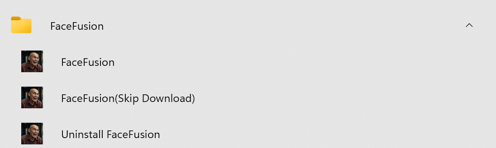

# FaceFusion Windows 安装包

本程序用于生成 FaceFusion 的 Windows 安装包。请注意，该安装包并非由 FaceFusion (https://github.com/facefusion/facefusion) 官方提供。

该安装包使用 Inno Setup 生成。有关 Inno Setup 的更多信息，请访问 [Inno Setup](https://jrsoftware.org/isinfo.php)。

## 注意事项
1. **非官方安装包**
   本工具并非由 FaceFusion (https://github.com/facefusion/facefusion) 官方提供的 Windows 安装包。

2. **测试阶段**
   该安装包仍处于测试阶段，因此可能存在不稳定的情况。

3. **技术能力要求**
   虽然本安装包可以用于 Windows 系统下 FaceFusion 的安装，但由于 Windows 下的安装环境较为复杂，需要使用此安装包的用户具有一定的技术能力，以应对可能出现的问题。因此，推荐使用 FaceFusion 官方的安装包。

## 安装后注意事项
安装完成后，将会生成如下三个快捷方式：

- **FaceFusion**：直接启动应用程序并开始下载所需的模型。
- **FaceFusion (Skip Download)**：启动应用程序但不会自动下载模型。它会在安装目录（默认路径为 `C:\FaceFusion`）下的 `src\.assets\models` 目录中寻找所需的模型。如果模型不存在，程序将会闪退。在这种情况下，您需要从 [FaceFusion Assets](https://github.com/facefusion/facefusion-assets/releases/tag/models) 下载后缀名为 .onnx 的模型，并手动复制到 `src\.assets\models` 目录中。
